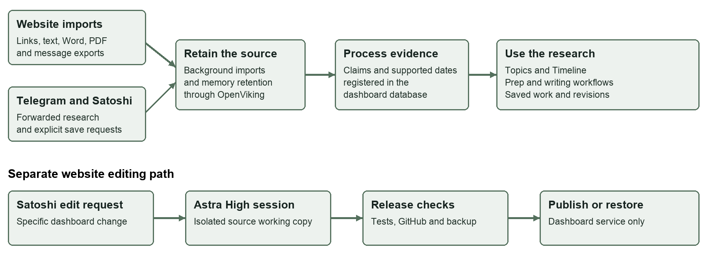

# Crypto Intelligence

A research workspace for collecting sources, exploring evidence, preparing for interviews and creating source-backed writing with Satoshi.

[Open the dashboard](https://crypto.forkedbrain.fyi/) · [Start using it](docs/handbook/quick-start.md) · [Documentation](docs/README.md) · [Dashboard code](dashboard/README.md)

## What you can do

| Workflow | What the current system provides |
| --- | --- |
| Collect research | Article URLs, pasted text, Word, PDF, text transcripts and Telegram JSON exports. Accepted website imports continue on the server after you leave. |
| Inspect evidence | Topics, retained sources, supporting passages and a Timeline built from supported dates. |
| Prepare and write | Prep, Haseeb bot and Tarun bot workflows, with saved outputs and writing revisions. |
| Work through Satoshi | Research conversations, retained memory, source registration and controlled dashboard edit requests. |
| Change the dashboard | A dedicated GPT-6 Astra High editing session, checked Git commits, release records and a restore path. |

Start with the [Quick Start](docs/handbook/quick-start.md). Read [formats and limits](docs/guides/uploads.md) before a large import. A queued source, retained source and processed source are different stages.

## How it fits together

The custom dashboard, integrations, project skills and release/recovery workflows use existing Hermes, OpenViking and infrastructure components. Those third-party systems are integrated here, not authored by this project. [Read the architecture](docs/architecture/README.md).

## Find your way around

| Location | What belongs here |
| --- | --- |
| [`dashboard/`](dashboard/README.md) | Frontend, backend, database migrations, import processing and application tests. |
| [`deploy/hermes/`](deploy/hermes/) | Hermes deployment contract, identity and project skills. |
| [`deploy/dashboard-editor/`](deploy/dashboard-editor/) | Dedicated editing wrapper, host release helper and boundary tests. |
| [`deploy/openviking/`](deploy/openviking/) | Memory service deployment references. |
| [`docs/`](docs/README.md) | User guides, architecture, development, operations, verification and handover. |
| [`forkedbrain/`](forkedbrain/) | Earlier application source retained for historical reference. |

## Source and release status

This is the documentation edition dated **22 September 2026**. The implementation reference is published commit [`209133f`](https://github.com/darshanahirrao/mark-personal-ai-ecosystem/commit/209133f4460771752e37e4de2c1f3747c85c82c5) on `satoshi-dashboard`.

- `main` is the default branch with the latest published dashboard source and reviewed documentation.
- `satoshi-dashboard` tracks the production release helper and its live release ledger.
- Feature branches hold proposed changes before they are integrated.

Updating `main` does not deploy the application. The release helper checks its branch against the live ledger, so changes to that branch must be coordinated with the release process. The [handover checklist](docs/handover/README.md) records what remains before ownership transfer.

The current system does not promise Telegram batch-capture mode, native OCR, direct audio/video transcription or unrestricted VPS administration by Satoshi. Historical test evidence and its limits are listed in [Verification](docs/verification/README.md).

## Start reading

- **Using the product:** [Quick Start](docs/handbook/quick-start.md) and [User Guide](docs/handbook/user-guide.md).
- **Maintaining the product:** [Development](docs/development/README.md), [Operations](docs/operations/README.md) and [Technical Handover](docs/handbook/technical-handover.md).
- **Reviewing ownership and support:** [Handover](docs/handover/README.md), [Support](SUPPORT.md) and [Security](SECURITY.md).

Prepared for Mark Gerhart by Darshan Ahirrao

Contact: [darshan@growthforgeai.com](mailto:darshan@growthforgeai.com)
