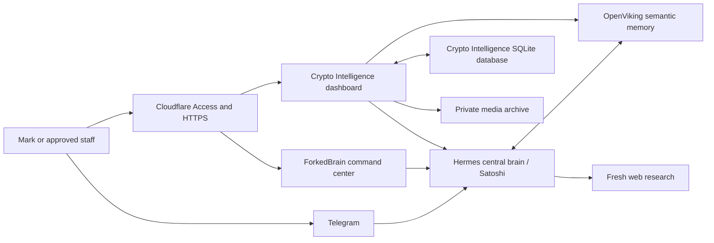

# Mark's Personal AI Ecosystem — Option 1 System Handbook

**Document status:** Authoritative, client-safe operational overview
**System covered:** Personal AI Ecosystem V2 and Crypto Intelligence Option 1
**Production checkpoint:** Crypto Intelligence and ForkedBrain release `20260811T132229Z`
**Last reviewed:** 2026-08-11

This handbook explains what the system is, how its components work together,
what has been verified, how Mark and approved staff use it, and what remains to
close Option 1 completely. It contains no passwords, API keys, tokens, private
SSH material, or raw client content.

## 1. Executive summary

Mark's Personal AI Ecosystem is a private, client-owned assistant environment.
Hermes is the single reasoning and agent layer, Satoshi is its user-facing
identity, and OpenViking is its persistent semantic memory. Crypto Intelligence
is the first specialist branch built on that shared brain.

The system currently provides:

- A private Satoshi assistant in Telegram and the Hermes web interface.
- A protected Crypto Intelligence dashboard for research, recall, analysis,
  quizzes, content generation, speaking preparation, and source capture.
- A private semantic memory containing the accepted legacy Crypto migration
  and new material saved through supported ingestion paths.
- A structured Crypto database containing sources, events, relationships,
  notes, drafts, quiz sessions, conversations, receipts, and audit history.
- A private ForkedBrain command center with a bounded, navigable memory graph.
- Cloudflare Access, HTTPS, key-only SSH, loopback-only application origins,
  non-root application containers, backups, recovery points, and rollback
  instructions.

The architecture deliberately avoids a second agent, second vector database,
parallel memory service, or custom reasoning engine. Product-specific code is
limited to the dashboard, deterministic source registration, security
boundaries, persistence, and presentation that Hermes and OpenViking do not
provide natively.

## 2. Production entry points

| Surface | Purpose | Access boundary |
|---|---|---|
| `https://forkedbrain.fyi/` | Private ecosystem overview and memory graph | Cloudflare Access exact-email allowlist |
| `https://crypto.forkedbrain.fyi/` | Crypto Intelligence dashboard | Cloudflare Access exact-email allowlist |
| `https://brain.forkedbrain.fyi/` | Native Hermes/Satoshi web interface | Hermes authentication |
| `https://manage.forkedbrain.fyi/` | Coolify management | Cloudflare Access plus Coolify authentication |
| `https://manage-realtime.forkedbrain.fyi/` | Coolify realtime transport | Cloudflare Access plus Coolify authentication |
| `intel.forkedbrain.fyi` | Legacy reference system | Kept isolated and unchanged during V2 delivery |
| `@ForkedBrainSatoshi_Bot` | Private Telegram assistant | Numeric Telegram allowlist |

Access is granted to named identities only. Being a member of the Cloudflare
account does not automatically grant application access; the person's exact
email must be present in the relevant Access policy. Telegram access is
independent and requires the person's numeric Telegram user ID to be added to
the bot allowlist.

## 3. System architecture

### Responsibility boundaries

| Component | Owns | Does not own |
|---|---|---|
| Hermes | Reasoning, tool use, research orchestration, conversation, skill routing | Structured dashboard persistence or public access control |
| Satoshi | The consistent friend-and-assistant identity presented to Mark | A separate model, agent, or memory store |
| OpenViking | Semantic ingestion, vectorization, retrieval, and durable contextual memory | Dashboard tables, visual graph selection, or user authentication |
| Crypto database | Sources, events, links, notes, drafts, quizzes, receipts, audit, deterministic search | Semantic reasoning or model inference |
| Crypto dashboard | Authenticated product workflows and structured presentation | A separate brain or vector database |
| ForkedBrain | Ecosystem navigation and a bounded visualization of structured memories | A complete visualization of every OpenViking memory |
| Cloudflare Access | Identity gate at the public edge | Hermes or Telegram user management |

## 4. The two complementary data views

The system has one semantic memory and one structured application database.
They serve different purposes and should not be confused.

### OpenViking semantic memory

OpenViking stores material so Satoshi and Hermes can retrieve it by meaning.
This includes the accepted Crypto migration, Mark's canonical owner context,
Creator Reference material, and new items deliberately remembered or ingested.
It is the reason Satoshi and the dashboard Ask workflow can recall material even
when the exact wording differs from the original source.

### Crypto Intelligence structured database

The SQLite database supports deterministic product behavior: a visible source
library, events and dates, relationships, notes, revisions, drafts, quizzes,
receipts, audit records, full-text search, and the graph projection. It contains
one unified structured index and enforces foreign-key integrity.

### Why both exist

OpenViking answers, “What stored material is conceptually relevant?” The Crypto
database answers, “Which exact source, event, note, draft, or receipt should the
product display and audit?” This is not duplicate reasoning or duplicate vector
memory. It is semantic memory paired with the structured records required by a
reliable application.

## 5. Ingestion behavior

### Dashboard Capture — fully registered path

The dashboard Capture workflow currently provides the complete two-sided path:

1. The authenticated user submits a public URL or pasted text.
2. The backend normalizes it and creates a deterministic SHA-256 identity.
3. Private-network and unsafe URLs are rejected.
4. Exact duplicates are skipped or safely repaired instead of copied again.
5. OpenViking performs native ingestion.
6. The backend verifies native acceptance.
7. Only then is the source registered in the Crypto database.
8. The source becomes visible in Library and eligible for dashboard search and
   graph ranking.
9. A receipt and audit record are preserved.

YouTube capture additionally requires a real transcript and exact stored
readback. Unsupported social URLs fail honestly and request pasted source text;
the system does not pretend a blocked page was captured.

### Telegram/Satoshi ingestion — registered path

Satoshi can accept crypto links, files, transcripts, and notes through Telegram
and store them in OpenViking. Once native ingestion completes, the Crypto skill
submits a small registration packet containing the source identity, title,
provenance, and OpenViking URI. It never sends the retained transcript through
the model or tool arguments. A durable queue reads the complete source directly
from OpenViking and applies the same canonical registration rules as Capture.

| Capability after Telegram ingestion | Current result |
|---|---|
| Satoshi can recall the material | Yes, after native ingestion completes |
| Dashboard Ask can use semantic memory | Yes, when retrieval finds the material |
| Source appears under Library → Sources | Yes, after the registration job reaches `ready` |
| Source is searchable through dashboard full-text search | Yes, including retained body text |
| Source is searchable through ForkedBrain's graph search | Yes |
| Source can become a graph node | Yes, subject to the 20-node relevance cap |

Registration is idempotent. Replaying the same Telegram event returns the same
job and canonical source without reprocessing it. Failed OpenViking ingestion
cannot produce a ready Library source.

### What should become a graph node

The graph is intentionally capped at 20 total visible nodes. It ranks selected
sources, events, themes, drafts, and retained research conversations from the
structured database. It is not intended to display every chat message or every
low-value memory.

Meaningful Crypto sources are eligible for ranking after registration. Extracted
events and insights should become nodes
only when they have durable value, provenance, and sufficient significance.
Casual discussion, duplicates, temporary instructions, secrets, and low-signal
items must remain excluded.

## 6. User workflows

### Brief

Brief is the daily command center. It combines current web research with stored
Crypto evidence, then presents changes, attention items, watchlists, suggested
actions, and direct routes into deeper workflows. Automatic refresh is bounded
to a 24-hour cadence, manual refresh is rate-limited, and the last accepted
brief remains available if a later refresh fails.

### Ask

Ask handles questions against the stored intelligence. The dashboard sends a
bounded evidence package to Hermes. Hermes returns the answer, while the
dashboard validates and displays resolvable evidence references. If Hermes is
unavailable, the interface labels the degraded state and returns only exact
corpus matches rather than presenting an unsupported generated answer.

### Timeline and Library

Timeline organizes events by subject date rather than capture date. Library
provides structured views of sources, events, media, and related records.
Original provenance is retained so stored evidence remains distinguishable from
generated interpretation.

### Connections and memory graph

Connections shows meaningful relationships between structured intelligence
records. The ForkedBrain graph provides a higher-level view centered on Mark,
with source, event, and artifact clusters. Search and filters operate over the
structured Crypto database, not the complete OpenViking semantic store.

### Quiz

Quiz generates questions only from verified evidence, records the session,
grades answers through one bounded Hermes call, explains corrections, and
preserves performance history.

### Studio and Speaking Preparation

Studio produces X threads, LinkedIn posts, review briefs, and speaking material.
Every stored generated draft must cite resolvable canonical records. Revisions
are append-only; editing creates a new revision rather than destroying the
original.

Speaking Preparation can generate theses, talking points, likely questions,
counterarguments, and closing takeaways for a selected topic or date window.

### Creator Reference

Creator Reference is an optional writing lens over manually supplied material
from one creator. It changes tone and framing only. It cannot replace verified
Crypto evidence, fabricate quotations, or present the output as genuinely
authored by the reference creator.

### Humanized Content

Humanization is an opt-in final writing pass. Mark can ask Satoshi to “humanize
this,” “make it more natural,” or “polish this.” It preserves facts, numbers,
dates, quotations, links, and canonical citations. It is not applied to research
answers or evidence records and does not claim to bypass authorship detection.

## 7. Satoshi interaction model

Satoshi uses one continuous conversation. Mark does not need to choose a topic,
mode, branch, or skill for normal work. Satoshi internally recognizes:

- General assistance and planning.
- Crypto Intelligence research, ingestion, recall, quizzes, and content.
- Creator Reference ingestion and writing requests.
- Explicit requests for humanization.

Clear labels such as “Save this to Crypto Intelligence” always win. Obvious
crypto material is routed automatically. If a source could reasonably belong to
Crypto Intelligence or Creator Reference, Satoshi asks one short clarification
before storing it.

## 8. Security posture

Verified production controls include:

- Ubuntu 24.04 LTS on a client-owned netcup server.
- SSH key-only access; password and keyboard-interactive SSH disabled.
- Root password login over SSH disabled.
- UFW active.
- Application origins bound to server loopback, not public service ports.
- Public access through an outbound-only Cloudflare Tunnel and HTTPS.
- Exact-email Cloudflare Access policies for protected browser surfaces.
- Numeric allowlist for Telegram users.
- Non-root dashboard and ForkedBrain containers.
- Read-only root filesystems, dropped Linux capabilities, and
  `no-new-privileges` on hardened application containers.
- OpenViking has no public host port or public domain.
- Secrets are excluded from Git, application images, and ordinary documents.
- The legacy Crypto system remains isolated during V2 acceptance.

## 9. Backups and recovery

The system has separate recovery layers because restoring application code,
structured data, and semantic memory are different operations.

| Recovery layer | Protection |
|---|---|
| Source code and deployment definitions | Private Git repository and portable VPS deployment kit |
| Crypto structured data | SQLite-consistent pre- and post-release backups |
| Semantic memory | Checksum-verified OpenViking volume archives |
| Hermes state | Configuration, skill, session-state, and volume recovery packages |
| Cloudflare changes | Owner-only before/after API state and rollback payloads |
| Legacy material | Frozen verified handoff and unchanged legacy reference service |

The accepted OpenViking backup was restored into a disposable volume under the
same pinned image. The restored service reached healthy state and an imported
target was read successfully before the disposable environment was removed.
Database backups have integrity and checksum checks. Exact operator paths and
rollback commands remain in the private infrastructure runbook rather than this
client-safe handbook.

## 10. Cost controls

- Embeddings use `text-embedding-3-small` and are inexpensive; existing vectors
  do not create a monthly OpenAI storage fee.
- OpenViking uses the approved economical model for high-volume native
  ingestion processing.
- Hermes uses `gpt-5.6-sol` with high reasoning for the central assistant.
- Daily intelligence refreshes are rate-limited and reuse the last accepted
  brief on failure.
- Ask, Studio, and Quiz send bounded context rather than the complete corpus.
- Duplicate ingestion is prevented by deterministic identities.
- High-cost models must not be introduced into bulk ingestion without a measured
  canary and an approved spend ceiling.

## 11. Verified acceptance state

At the accepted production checkpoint:

- Database integrity check: `ok`.
- Foreign-key violations: zero.
- Canonical structured corpus: 66 events, 49 sources, and 89 media assets.
- Semantic migration: 197 deterministic identities accepted and independently
  replayed with 197 skips, zero duplicate creates, and zero failures.
- Representative semantic reads and production citations resolved.
- Source-grounded Ask, Studio generation/revision, Quiz generation/grading,
  native Capture, private media, daily intelligence, Creator Reference,
  Satoshi persona, and humanization passed acceptance.
- Two existing Satoshi/OpenViking Crypto sources registered through the live
  queue, became searchable in the dashboard and ForkedBrain graph, remained
  deduplicated on replay, and survived both application restarts.
- Public ForkedBrain and Crypto surfaces remained behind Cloudflare Access.
- The legacy Intel endpoint remained unchanged.
- The current dashboard container remained healthy, non-root, read-only,
  capability-dropped, and loopback-only.

## 12. Remaining Option 1 closeout

### Functional work

The Telegram-to-dashboard synchronization implementation is complete. Remaining
work is client acceptance rather than another ingestion or memory component.

### Account and acceptance work

1. Add Mari's numeric Telegram ID when supplied.
2. Complete Mark and Mari real-account acceptance of Satoshi.
3. Remove the temporary implementation tester only after explicit approval.
4. Capture any client-requested restore demonstration or screen recording.
5. Deliver the refreshed client handoff pack for release `20260811T132229Z`.

## 13. Change-management rules

For every production mutation:

1. Record the planned scope and rollback in the operations ledger.
2. Create the relevant backup before changing the service.
3. Change only the named component.
4. Run local tests and an isolated canary where practical.
5. Promote with a retained rollback image or configuration.
6. Verify internal health, public access, identity boundaries, persistence, and
   the unchanged legacy endpoint.
7. Complete the operations entry with observed evidence and recovery details.
8. Never copy secrets into Git, chat, screenshots, or client-safe documents.

## 14. Supporting documents

- [Technical architecture](architecture/SYSTEM-ARCHITECTURE.md)
- [Mark and staff user guide](operations/USER-GUIDE.md)
- [Current acceptance and remaining-work matrix](acceptance/CURRENT-STATUS-AND-ACCEPTANCE.md)
- [Infrastructure runbook](infrastructure/RUNBOOK.md)
- [Infrastructure source of truth](infrastructure/README.md)
- [Option 1 production snapshot](infrastructure/state/2026-08-07T161100Z-option1-final-redacted.md)
- [Crypto migration acceptance](migration/CRYPTO-V2-MIGRATION-REVIEW.md)
- [Dashboard implementation guide](../dashboard/README.md)
- [Hermes deployment guide](../deploy/hermes/README.md)
- [Portable VPS deployment guide](../deploy/portable-vps/README.md)
