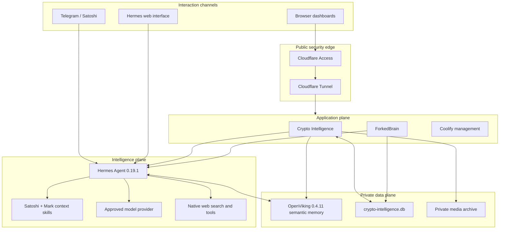
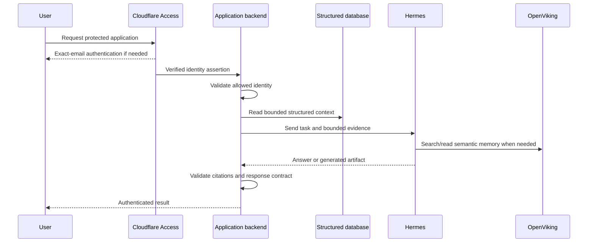
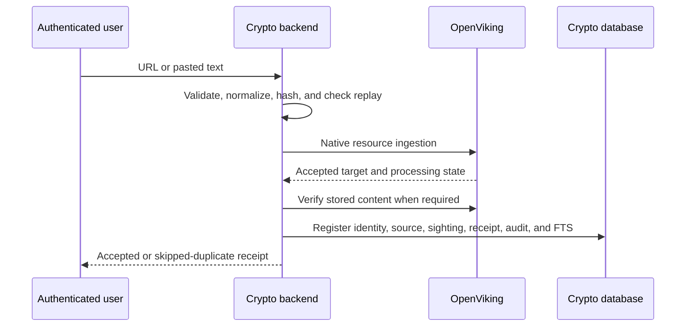
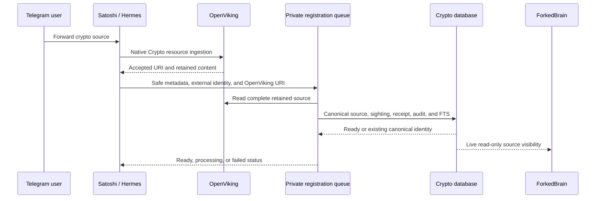

# Personal AI Ecosystem V2 — Technical Architecture

**Applies to:** Mark Gerhart, Crypto Intelligence Option 1
**Architecture principle:** one Hermes brain, one OpenViking semantic memory,
one Crypto structured database, and thin product surfaces
**Reviewed:** 2026-08-10

## 1. Design objective

The system must behave like one private personal assistant that can grow into
additional branches without duplicating identity, reasoning, or memory. Crypto
Intelligence is the first specialist application, not a separate bot or brain.

The implementation rule is simple: use Hermes and OpenViking natively wherever
they already solve the problem. Add custom code only for authenticated product
interfaces, deterministic structured records, source provenance, auditability,
and operational controls.

## 2. Logical layers

## 3. Runtime components

### Host

- netcup RS 2000 G12.
- Ubuntu 24.04.4 LTS, AMD64.
- Docker and Coolify management layer.
- UFW host firewall.
- SSH key-only administration.

### Hermes

- Pinned Hermes Agent release `0.19.1` / `v2026.7.30`.
- Persistent `/opt/data` volume.
- Loopback-only browser origin.
- Native Telegram polling gateway.
- Native OpenViking provider.
- Native `openai-api` inference provider using `gpt-5.6-sol` with high
  reasoning at the accepted checkpoint.
- Resource limits prevent the agent from exhausting the host.

### OpenViking

- Pinned release `0.4.11`.
- Private Docker network only; no host port or public route.
- Encrypted persistent state.
- Tenant-scoped credential supplied to Hermes.
- Native resource ingestion, embeddings, semantic search, and content reads.
- Accepted deterministic migration of 197 Crypto identities.

### Crypto Intelligence

- Fastify/TypeScript backend.
- React/Vite frontend.
- Loopback-only host origin.
- Cloudflare Access identity required on production requests.
- Non-root runtime, read-only root filesystem, capability-drop and
  `no-new-privileges` controls.
- No model-provider credential in the application container.
- Bounded calls to Hermes for reasoning.
- Tenant-scoped OpenViking credential supplied through a read-only file mount
  for Capture.

### ForkedBrain

- Next.js private command center.
- Read-only database access.
- Bounded force-directed memory graph with at most 20 visible nodes.
- Selected-memory chat through Hermes.
- No separate memory or reasoning service.

## 4. Storage contracts

### Semantic contract

OpenViking is the semantic source of truth. Resources are stored under explicit
context branches, including Crypto Intelligence, Creator Reference, and Mark's
canonical owner context. New material is accepted only after native tooling
confirms the write. Semantic recall uses search followed by reads of the
strongest candidates.

### Structured contract

`crypto-intelligence.db` is the application system of record. It contains:

- `schema_migrations` for forward-only schema history.
- Sources and normalized source identity.
- Events, categories, significance, dates, facets, and relationships.
- Media metadata and controlled media references.
- Canonical identity mappings and OpenViking URIs.
- Source sightings and ingestion receipts.
- Notes and append-only note revisions.
- Drafts and append-only draft revisions.
- Quiz sessions and answers.
- Conversation history and saved views.
- Audit records.
- One unified FTS5 search index.

Every source is identified deterministically. URL identity is derived from a
normalized URL after removing fragments and known tracking parameters. Pasted
text identity is derived from normalized content. Exact replay must skip rather
than create a second source.

### Provenance contract

Structured records distinguish migrated data from post-migration ingestion.
Generated answers and drafts must not masquerade as source evidence. Where the
workflow requires citations, every canonical citation must resolve before the
output is persisted.

## 5. Request paths

### Authenticated browser request

### Dashboard Capture

The database write occurs only after native memory acceptance. If memory
processing fails, the application does not mark the source ready.

### Telegram Crypto ingestion and dashboard registration

The bridge invokes the existing application registration contract only after
successful native ingestion. It does not perform semantic ingestion again. The
service endpoint is authenticated with a file-mounted secret and receives no
transcript, provider key, or browser credential. The persistent FIFO queue is
restart-safe, bounded to one active registration, retries transient failures,
and deduplicates both the Telegram external identity and canonical source.

## 6. Intelligence workflows

### Ask

The backend builds a small evidence package from exact structured records.
Hermes remains the reasoning plane and may consult shared semantic memory. The
backend checks the response boundary and returns canonical evidence. A provider
failure produces a visible degraded state rather than fabricated continuity.

### Daily intelligence

Hermes combines fresh web research with stored evidence. The result must label
fresh information separately from stored knowledge and interpretation. Refresh
frequency and manual requests are bounded to protect cost and stability.

### Studio and Quiz

The backend owns input validation, evidence packaging, citation resolution, and
atomic persistence. Hermes owns generation and grading. No draft or score is
partially persisted when its validation fails.

## 7. Graph architecture

ForkedBrain reads the structured database in query-only mode. Candidate nodes
come from sources, events, themes, drafts, and retained conversations. Ranking
uses structured signals such as event significance, relationship count,
pinned/note state, connected events, theme size, and recency. Labels are
deduplicated, and the result is capped at 20 total visible nodes.

Graph search filters structured candidates and also matches the unified FTS
body for registered sources. It is not a direct OpenViking semantic query.
Telegram resources appear after their registration job reaches `ready`; the
default view still applies the 20-node relevance cap.

## 8. Identity and authorization

### Browser

Cloudflare validates the public identity. The backend also requires the verified
identity assertion on production application requests. Allowed emails are exact
matches; domain-wide or everyone rules are not part of the accepted policy.

### Telegram

Telegram's numeric user ID is the authorization boundary. Display name and
claims inside a message do not change authorization. Mark has a dedicated owner
channel prompt. Approved collaborators use the same assistant and project
context without becoming a separate tenant.

### Services

Hermes and OpenViking communicate on a private network. Service credentials are
scoped and stored outside source control. Applications do not receive broader
credentials than their task requires.

## 9. Failure behavior

- Provider unavailable: show a degraded state; do not present lexical matches
  as generated analysis.
- OpenViking unavailable: refuse new Capture registration; retain existing
  structured data.
- Unsupported or blocked source: request pasted text; do not report success.
- Duplicate source: skip or repair the same identity; do not copy it.
- Partial generation: roll back the database transaction.
- Invalid citation: reject persistence.
- Web refresh failure: retain the last accepted brief.
- Cloudflare or DNS change failure: restore the captured before-state.
- Release failure: retain the previous image and verified database backup.

## 10. Expansion model

Future branches should reuse Hermes identity, OpenViking memory, Cloudflare
security, and the operations discipline. A new branch may add a thin structured
application store only when its product requires durable records that semantic
memory cannot represent reliably. It should not add another brain, router,
generic vector store, or model provider by default.
