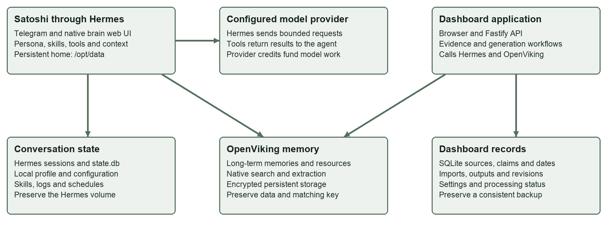
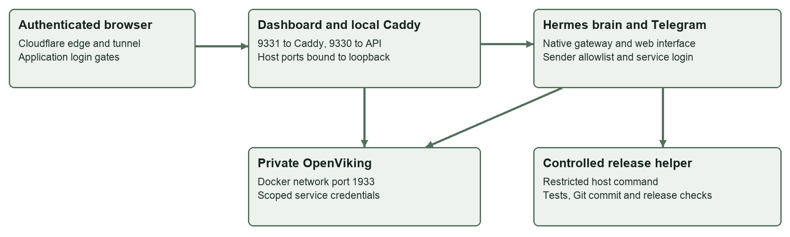

# Crypto Intelligence Technical Handover Guide

Version 1.1 | 22 September 2026

Prepared for Mark Gerhart by Darshan Ahirrao
darshan@growthforgeai.com

## Start with the VPS

The VPS is the remote Linux server that keeps the system running when a user closes their browser or laptop. Docker runs the individual services on that server. Persistent directories and volumes hold the data that must survive a container replacement.

Host detail | Current inventory
--- | ---
Hosting provider and recorded plan | netcup, RS 2000 G12
Public IPv4 address | 159.195.16.212
Operating system | Ubuntu 24.04.4 LTS, AMD64
CPU and memory | 8 logical CPUs; approximately 15.6 GiB usable memory reported by Linux
Root filesystem | 503 GiB total; 39 GiB used and 444 GiB available at inspection
Administrative SSH | Port 22; existing operator alias mark-netcup-v2 resolves to this host
Application runtime | Docker containers, with Coolify and the existing host deployment helpers
Public web routing | Cloudflare tunnel to the appropriate host loopback service

### Three administration layers

- The netcup account and Server Control Panel manage the server itself. Access is separate from the application login.
- Coolify is the service-management layer for the existing application stack. It has its own access gate and supporting database.
- SSH is the operator’s direct administration path. The current operator configuration uses root with an approved key; provide the receiving maintainer with their own authorised access during handover.

### Normal users do not need server access

Use the dashboard for research and Satoshi for assistant tasks. Changing a website label through the controlled editor is different from restarting the VPS, changing a tunnel or replacing a database.

The capacity values are a point-in-time reading, not a capacity guarantee. The current service set shares this host. Changing or deleting a Docker volume can affect persistent data even when the website code remains in Git.

The provider plan comes from the infrastructure record; operating system, CPU, memory and disk figures were checked directly on the host for this edition.

## Public URLs and who uses them

Use this address register to choose the correct interface. Passwords, account recovery details and private keys are supplied separately. The domains below are the currently configured deployment addresses.

Address | Audience | Purpose
--- | --- | ---
https://crypto.forkedbrain.fyi/ | Users | Crypto Intelligence dashboard: research, imports, evidence, Prep and writing.
https://brain.forkedbrain.fyi/ | Authorised users | Native Hermes assistant interface behind Satoshi.
https://t.me/ForkedBrainSatoshi_Bot | Allowed Telegram users | Verified public bot username. Knowing the link does not add a sender to the allowlist.
https://manage.forkedbrain.fyi/ | Maintainer | Coolify administration. Do not use it for ordinary research.
https://manage-realtime.forkedbrain.fyi/ | Coolify client | Supporting realtime connection, not a separate user workspace.
https://forkedbrain.fyi/ | Legacy only | Older application route. Its container was unhealthy; use the crypto dashboard for the current workflow.
https://www.servercontrolpanel.de/ | Hosting owner | netcup Server Control Panel.
https://www.customercontrolpanel.de/ | Hosting owner | netcup Customer Control Panel and account access.

### How these addresses were checked

The five project web routes were read from the host tunnel configuration. The crypto root responded with HTTP 200; the other four returned HTTP 302. A redirect confirms an entry route responded, not a complete authenticated application test. The bot username was verified with Telegram getMe without sending a message.

The netcup panel links are confirmed by the provider’s login documentation: https://www.netcup.com/en/helpcenter/documentation/general/scp-login

The GitHub repository address is ownership-dependent and must be recorded after transfer. Until then, resolve the current remote from the host git-store. OpenViking has no public URL; its private service address is listed in the next chapter.

## Host routing ports and service management

The domain names reach a Cloudflare tunnel. The tunnel forwards each hostname and any matching path to a local service. Container-to-container calls use the existing private Docker network rather than a public memory endpoint.

Route or connection | Configured destination
--- | ---
crypto.forkedbrain.fyi | 127.0.0.1:9331, Caddy; forwards to the dashboard at 9330 / container 5183.
brain.forkedbrain.fyi | 127.0.0.1:9119, native Hermes web interface.
manage.forkedbrain.fyi | 127.0.0.1:8000 for the main Coolify application.
manage terminal WebSocket path | ^/terminal/ws.* routes to 127.0.0.1:6002 before the general management route.
manage-realtime.forkedbrain.fyi | 127.0.0.1:6001 for the supporting realtime service.
forkedbrain.fyi | 127.0.0.1:9320 for the legacy application.
OpenViking private endpoint | http://openviking:1933 within the Docker network; no host-published memory port.
Unmatched tunnel request | Configured fallback returns HTTP 404.

### Host files and service boundaries

```text
Tunnel routing: /etc/cloudflared/config.yml
Docker network: 27am3wgv7vkohkenprml4s3p
Dashboard root: /srv/mark-v2/crypto-dashboard/
Private configuration: /srv/mark-v2/secrets/
```

Coolify 4.3.19 is supported by coolify-db (PostgreSQL 15), coolify-redis (Redis 7), coolify-realtime, coolify-sentinel and coolify-proxy (Traefik). These support deployment management. The dashboard application database is SQLite, not the Coolify PostgreSQL database.

The host deployment helper manages controlled dashboard releases. Do not recreate the dashboard from an older local Compose image reference. Hermes and OpenViking belong to their existing stack and retain their named volumes.

Keep the tunnel hostname and path ordering when maintaining routes. Do not remove authentication or expose private ports to work around a failed login. Diagnose the public edge, login service and local API separately.

## System architecture

Custom work includes the dashboard, integrations, project skills and controlled release and recovery workflows. Hermes, OpenViking, Docker, Coolify and Caddy are third-party components configured and integrated into this system, not software authored for this project.


### Responsibilities

- Dashboard: React and Vite browser interface, with a Fastify and TypeScript API. SQLite stores the application view, imports, processing jobs, evidence and saved workflow results.
- Hermes: the native assistant runtime behind Satoshi. It handles conversations, research skills, generation and the dedicated editing session.
- OpenViking: retained research and memory. A successful file selection in the browser is not proof of completed retention.
- Deployment: Docker services on the VPS, with the existing Cloudflare edge and Caddy login path. Coolify manages other parts of the service environment.

The dashboard editor is instructed to work only on dashboard source changes. It is not a full VPS management agent. The older forkedbrain application is a separate legacy service and was unhealthy during this documentation check; the current crypto-dashboard service was healthy.

## The brain Hermes and Satoshi

Hermes is the running agent software. Satoshi is the assistant identity and set of project skills configured inside it. The brain website is Hermes’s native web interface. OpenViking is its memory service. These names describe different responsibilities in one system.



### What runs where

Hermes code lives at /opt/hermes inside its container. Its persistent home is /opt/data. The home contains configuration, authentication state, sessions, memory profile files, skills, schedules, logs and the controlled dashboard editor. Replacing the container image should retain this volume.

The model is called through the configured provider. Hermes assembles the request, runs approved tools, receives results and continues the task. A model reply alone does not prove a source was saved, a queue finished or a website release deployed.

### Interface boundaries

Telegram and the native brain web interface use Hermes. Dashboard workflows call Hermes through its authenticated web API. Separate sessions can share retained memory without sharing every live chat message. The dashboard remains its own application with its own database and authentication.

Reference: deploy/hermes/docker-compose.yml, deploy/hermes/SOUL.md and dashboard/server/src/hermes-client.ts. The installed Hermes source is authoritative for its native runtime behaviour.

## From a message to an answer

1. A message arrives through an allowed Telegram sender, the authenticated brain interface or the dashboard integration.
2. Hermes selects the conversation context and combines the user’s request with its system instructions, persona, applicable skills and available tools.
3. The native memory provider can load relevant profile context and recall useful memories. For research, the assistant can explicitly search and read retained resources.
4. Hermes calls the configured model. The model may request tools, such as reading a source or queuing dashboard registration. Hermes executes permitted tools and returns their results to the conversation.
5. The assistant responds. The native memory lifecycle can synchronise conversation turns and extract durable memories at its commit boundaries. Dashboard actions separately persist their own results.

### Context is a working window

A model can receive only a bounded amount of context in one request. Long conversations can be compacted to keep the working context manageable. Compaction is a summary operation, not a full backup and not a guarantee of word-for-word recall.

The live configuration uses a 500-turn agent limit. This is a maximum permitted loop length, not a prediction of processing time and not a promise that a task will finish. A long loop can consume credits across many calls.

### Interruption and retry

An interrupted chat task, an accepted import job and an editor release have different lifecycles. Check the job or release status before resubmitting. A fresh conversation can retrieve saved sources, but it does not automatically replay an interrupted command.

### Implementation landmarks

```text
/opt/hermes/agent/memory_manager.py
/opt/hermes/agent/context_compressor.py
/opt/hermes/plugins/memory/openviking/__init__.py
/opt/hermes/gateway/session_context.py
```

These are installed runtime paths for inspection, not project files to patch as part of ordinary dashboard maintenance.

## The memory and storage map

Layer | What it stores | Recovery implication
--- | --- | ---
Current context | Selected messages, instructions and retrieved evidence sent to the model. | A working window, not a complete archive.
Hermes persistent home | Sessions, state.db, configuration, skills, logs and local profile state. | Preserve the Hermes volume. Review private content before sharing.
OpenViking memories | Extracted facts, preferences and other long-term context. | Preserve encrypted storage, configuration and the required key.
OpenViking resources | Retained articles, transcript text and creator references. | A resource URI identifies retained material; search indexes help retrieve it.
Dashboard SQLite | Sources, evidence, dates, jobs, draft revisions, saved outputs and settings. | Use a consistent database backup including active write state.
Git and releases | Website code commits, release records and build references. | Code rollback does not roll back research or conversation history.

### The local profile is not the entire memory system

The live /opt/data/memories directory contained USER.md and its lock file when inspected. No MEMORY.md was present in that directory. Do not document a second, active MEMORY.md store merely because other Hermes installations use one.

SOUL.md describes assistant identity and behaviour. Skills describe procedures. Neither should become a substitute for the canonical retained sources or a place to copy credentials.

### One authority for each question

Use the original retained source for what an article said, the dashboard job record for whether processing finished, the release ledger for what code is live, and the provider account for available credits. These are different questions with different sources of truth.

## Inside OpenViking

OpenViking is the native external memory provider selected in Hermes. Its optional standalone bot is disabled. It provides retained resources, extracted memory and semantic retrieval without adding another user-facing assistant.

Setting | Verified installation
--- | ---
Image | ghcr.io/volcengine/openviking:v0.4.11
Private endpoint | http://openviking:1933, reachable on the Docker network
Persistent mount | /app/.openviking
Storage | Native local AGFS and vector database under its data workspace
Embedding model | OpenAI text-embedding-3-small, 1536 dimensions
Extraction and summary model | OpenAI gpt-5.6-luna
Encryption | Enabled, local provider; recovery depends on the encryption key
Authentication | Separate service credentials and tenant scope; keep root credentials out of Hermes

### How retrieval works

An embedding represents meaning as numbers so related material can be found even when wording differs. OpenViking supports an abstract, an overview and full content, often described as L0, L1 and L2. Search finds candidates; reading full content supplies the evidence. A search match alone is not a verified claim.

### Resource organisation

```text
viking://resources/crypto-intelligence/
viking://resources/creator-reference/
```

Memories use the user or configured assistant scope resolved by the native provider. Do not invent a new tenant or move existing records simply to match an example URI. Resource and memory locations are related but not interchangeable.

The named volume is 27am3wgv7vkohkenprml4s3p_openviking-data. ov.conf configures the server; ovcli.conf configures a CLI connection. Both can contain secrets. Older repository notes name a previous extraction model; the values above come from the running configuration inspection.

## Memory writes recall and corrections

Native tool | Meaning
--- | ---
viking_search | Find relevant memory or resources. Results have retrieval limits.
viking_read | Read an identified URI at the requested detail level.
viking_browse | Inspect the available hierarchy.
viking_add_resource | Retain a document or URL as a resource.
viking_remember | Submit a fact to native asynchronous memory extraction.
viking_forget | Delete a specific supported memory-file URI, not a whole resource tree.

### Submitted is different from stored as a new fact

The installed viking_remember implementation creates a separate one-shot OpenViking session, adds the fact and commits it for extraction. A submitted result can lead to a new memory, a merge or no memory operation. The acknowledgement can include a session or extraction task identifier.

Hermes also has native conversation synchronisation and session-end handling. Its provider can prefetch profile information and recall relevant memory within token and timeout budgets. This does not load the entire archive into each model request.

### Correct and delete deliberately

Built-in local memory additions can be mirrored into OpenViking. The installed provider does not mirror local replace and remove operations because they lack stable OpenViking record URIs. A local edit is therefore not proof that the remote memory changed.

Identify the exact record, apply the supported operation and verify it by reading or searching afterward. The native forget tool rejects resources, directories, sessions and generated summary files. Broader resource cleanup needs the appropriate administrative API and a review of dashboard references.

### If a commit fails

Inspect the reported OpenViking session before resubmitting. The fact may already have been accepted while extraction is pending. Follow the installed provider recovery guidance using the same service profile. Do not create duplicate facts by guessing that every timeout meant nothing was saved.

## Skills persona and instructions

Skills are task instructions and supporting scripts available to Hermes. They guide tool use; they are not independent agents, separate databases or evidence that a software feature has been deployed.

Skill or file | Responsibility
--- | ---
SOUL.md | Satoshi identity, conversational style and behaviour.
satoshi | Route the single assistant across supported contexts and retrieve canonical owner context when relevant.
crypto-intelligence | Retain research, retrieve evidence and register retained sources with the dashboard.
creator-reference | Store and retrieve writing references separately from factual research.
mark-general | General assistance. This is an existing technical directory name.
humanized-content | A writing refinement pass. Dashboard generation invokes it in its workflow prompt.
dashboard-editor | The bounded Astra High editing and release workflow.

### Locations

```text
Repository: deploy/hermes/skills/mark/
Runtime: /opt/data/skills/mark/
Persona: /opt/data/SOUL.md
Dashboard instructions: prompt_settings and prompt_revisions
```

### Different kinds of improvement

A message saying that a SKILL.md was updated means task guidance changed. It does not mean the website source, database or production deployment changed. Dashboard changes need the editor and publication controls. Server-wide changes require the responsible operator.

Control center instructions affect dashboard generation and are saved with revisions. They do not change provider credentials or container permissions. Keep the repository and installed skills aligned when maintaining an approved skill change.

All permitted Telegram users work within the approved shared project context. Sender identity must remain accurate. Separate chat sessions do not establish isolated customer tenants.

## Model routing and provider costs

Work | Current route
--- | ---
Ordinary Satoshi conversation | Hermes default gpt-5.6-sol via openai-api; configured High reasoning.
Dashboard Prep and creator output | Native Hermes agent session, with tools and memory. The workflow explicitly requests Low reasoning.
Source evidence extraction | Bounded Hermes llm.oneshot request, not a full conversational agent run.
Dashboard source editing | gpt-6-astra, High reasoning; terminal and file tools only. Memory, background review and context files are disabled. Limit: 100 iterations / 30 minutes.
OpenViking semantic indexing | text-embedding-3-small, 1536-dimensional embeddings.
OpenViking extraction and summaries | gpt-5.6-luna configured in the memory service.

### One project can incur several kinds of usage

Retaining an article, extracting memory, analysing evidence, answering a question and editing code can each call a model. Uploading 30 sources may trigger several stages per source. The number of uploads is not the number of billable model requests.

The dashboard has no direct model-provider credential in its container contract. It reaches Hermes for generation and OpenViking for memory. Those services hold their own configured provider access. Do not infer that all credentials belong to the same billing project without checking the private configuration.

### What an operator should track

- Provider usage and remaining balance for the actual configured accounts.
- Long-running tasks, repeated failed jobs and scheduled generation.
- Model availability for both ordinary work and the pinned editing route.
- Separate VPS, domain and service costs outside model usage.

No fixed per-source price or automatic top-up is promised by this installation. A successful balance top-up does not replay failed application jobs. The recovery helper only addresses a narrowly recognised stale provider status.

## Network authentication and trust boundaries



Connection | Boundary
--- | ---
Browser to crypto dashboard | Cloudflare edge and tunnel to local Caddy, then the dashboard. Shared login, server-verified Turnstile and signed Secure HttpOnly session.
Browser to brain | Hermes native web interface with its configured access gates. Do not reuse the crypto login implementation by assumption.
Telegram to Hermes | Native Telegram gateway and numeric sender allowlist.
Dashboard to Hermes | Service login, WebSocket ticket and native RPC. The server keeps these credentials out of the browser.
Dashboard or Hermes to OpenViking | Private Docker network and scoped service authentication. No public OpenViking port.
Editor to host | Restricted SSH command invokes the release helper; no general Docker socket mounted into Hermes.

The dashboard publishes 9330 and its Caddy gateway publishes 9331 on host loopback only. Hermes uses its existing loopback 9119 path. External access is provided through the configured edge routes, not by exposing those ports publicly.

The dashboard has a read-only container root and a writable data mount. Secrets are file-mounted read-only. These boundaries reduce accidental access; they do not replace backups, access reviews or careful release checks.

## Production inventory

These locations describe the verified deployment on 21 September 2026. Treat them as an inventory snapshot. Recheck the host and release ledger before operating on a later deployment.

Component | Location or identifier
--- | ---
Public dashboard | https://crypto.forkedbrain.fyi/
SSH host alias | mark-netcup-v2
Dashboard container | crypto-dashboard
Dashboard host port | 127.0.0.1:9330 to container 5183
Login container | crypto-auth, host 127.0.0.1:9331
Hermes container | hermes-27am3wgv7vkohkenprml4s3p
Hermes release | nousresearch/hermes-agent:v2026.9.7
Memory container | openviking-27am3wgv7vkohkenprml4s3p
Memory release | OpenViking v0.4.11
Compose project | crypto-dashboard-20260905t095230z
Recovery timer | mark-hermes-recovery.timer

### Important host paths

```text
/srv/mark-v2/crypto-dashboard/deploy/docker-compose.production.yml
/srv/mark-v2/crypto-dashboard/data/crypto-intelligence.db
/srv/mark-v2/crypto-dashboard/git-store
/srv/mark-v2/crypto-dashboard/release-history.json
/srv/mark-v2/crypto-dashboard/releases/
/srv/mark-v2/secrets/crypto-dashboard.env
```

Hermes code is under /opt/hermes in its container. Its persistent state is /opt/data, backed by the named Docker volume 27am3wgv7vkohkenprml4s3p_hermes-data. Resolve that volume with docker volume inspect rather than assuming a different host path.

Authentication uses a shared dashboard login with Turnstile and a signed session cookie. The crypto dashboard does not use the older email OTP flow described in some legacy notes. Telegram access uses the configured numeric user allowlist. Keep all credential values outside documentation and Git.

## Find the relevant code

In the project checkout, use 02-Project-Workspace as the implementation root. The published dashboard branch is satoshi-dashboard. Do not assume the main branch is the latest deployed dashboard.

Task | File or directory relative to implementation root
--- | ---
Navigation and page routes | dashboard/web/src/App.tsx
Upload form and format labels | dashboard/web/src/screens/Sources.tsx
Topics and Timeline | dashboard/web/src/screens/Topics.tsx; dashboard/web/src/screens/TopicDetail.tsx; dashboard/web/src/screens/Timeline.tsx
Prep and writing | dashboard/web/src/screens/Prep.tsx; dashboard/web/src/screens/CreatorBot.tsx
Saved outputs and instructions | dashboard/web/src/screens/SavedWork.tsx; dashboard/web/src/screens/ControlCenter.tsx
Import queue and extraction | dashboard/server/src/imports.ts; dashboard/server/src/documents.ts
Retention and evidence | dashboard/server/src/ingestion.ts; dashboard/server/src/source-processor.ts; dashboard/server/src/source-queue.ts
Topic rebuilding | dashboard/server/src/topic-jobs.ts
Editor and release integration | deploy/dashboard-editor/
Installed custom skills | deploy/hermes/skills/mark/
Quota recovery helper | deploy/hermes-recovery/

### API landmarks

The browser uses /api/imports for imports, /api/sources for retained material, /api/processing for extraction status, /api/topics and /api/events for evidence views, /api/workflows for saved work, /api/prep and /api/creator for generation, and /api/prompt-controls for instructions. Internal Telegram sync uses /api/internal/telegram-sync with its service authentication.

Legacy backend endpoints do not imply a visible current menu item. The current sidebar is Topics, Timeline, Prep, Haseeb bot, Tarun bot, Sources and imports, Saved work and Control center. Some older project guides describe a previous interface.

## Dashboard database and record relationships

The dashboard uses one SQLite database with foreign keys, WAL journaling and a five-second busy timeout. It holds the application’s structured view of retained research. OpenViking remains a separate native memory service; SQLite is not a substitute for its resources.

Record family | Purpose
--- | ---
sources and source_sightings | Canonical source records and observed instances. Identity and receipts track registration.
events and event_evidence | Extracted claims and their supporting passages.
event_dates and related facets | Supported dates and precision, entities, tags, categories and connections.
event_topics and event_editorial | Topic membership and editorial presentation, including source metadata classification.
import_batches and import_items | Accepted bulk submissions and durable item-level jobs.
source_sync_jobs | Telegram handoff references and safe metadata.
source_processing and chunks | Extraction status, attempts and progress through a long source.
content_drafts and draft_revisions | Saved draft content and append-only revisions.
workflow_results | Structured Prep or creator result, inputs and revision reference.
prompt_settings and revisions | Page instructions and their change history.
app_settings and generation_meta | Background job state, scheduler settings and generated brief metadata.
search_index and audit_log | FTS5 search and an operational activity trail.

Base tables are defined in server/src/build-db.mjs; forward runtime migrations are in server/src/db.ts and recorded in schema_migrations. Legacy Ask, Quiz and conversation tables can remain even when those features are not visible as separate current menu items.

A source may support many claims and dates. One import can already be saved while its analysis is pending. Document jobs initially retain their upload payload, replace it with extracted text after parsing, and clear the payload after successful retention. Failed jobs can retain pending content. Include them when reviewing data retention or deletion.

## Imports and data lifecycle

Retention and evidence extraction are separate durable stages. Diagnose the stage that failed before rerunning a job or changing the source record.

1. POST /api/imports validates the request and accepts persistent import jobs. The browser can split submissions into bounded requests.
2. The import worker fetches article text or extracts document text. Word and PDF extraction runs in the server environment, not in the editing agent container.
3. The ingestion path retains the source in OpenViking and registers the dashboard source. Identity checks avoid supported duplicate cases.
4. The evidence queue extracts claims and supported dates, recording success or failure per source.
5. Topics and Timeline read the stored evidence. Saved work and instruction histories are separate application records.

### Limits and interpretation

- 5,000,000 bytes per file; 250,000 extracted characters per document. The browser normally groups up to 100 items and roughly 4 MB of JSON; the API accepts a larger body to carry a single base64-encoded document.
- Telegram JSON expands text messages. Media-only entries are not converted into transcripts. CSV is document text rather than a row importer.
- Scanned PDFs require OCR before ingestion. Validate file signatures and extraction errors; changing a filename extension is not conversion.
- Event dates require source support. Preserve publication and capture dates as provenance rather than substituting them for missing event dates.

### Safe investigation

Read import status, retained source and extraction status together. Use the stage-specific retry endpoints exposed by the UI. A retry should not create synthetic live research. For integration tests, use an isolated database and mocked or isolated memory service.

Do not run a database rebuild or force an old baseline onto production. For correction or deletion, trace both dashboard records and retained memory, identify dependent evidence and review the precise scope before changing data.

## Trace Telegram research into the dashboard

1. Satoshi loads the Crypto Intelligence skill for research retention. It preserves the available message text, caption, source link and date.
2. The native OpenViking resource operation retains the source. The assistant obtains the accepted resource URI rather than passing the entire conversation to the dashboard.
3. The skill calls its sync_dashboard_source.py helper. The authenticated internal endpoint accepts an external identifier, resource URI and safe metadata.
4. The dashboard stores a source_sync_jobs entry. Its worker reads the actual retained source from OpenViking, then registers the canonical source and receipt.
5. The normal evidence queue processes the source. The resulting claims and supported dates become available through Topics and Timeline.

### Two confirmations matter

A retained OpenViking resource and a completed dashboard registration are separate checkpoints. An assistant’s memory acknowledgement is insufficient proof that the source has reached the website. Likewise, registration is not proof that every evidence chunk has finished.

### Queue behaviour

The sync worker checks every second, processes one active job at a time and permits up to five attempts with bounded backoff. The external identifier prevents replay from creating another handoff job. Processing jobs are recovered to queued state after a dashboard restart.

### Trace one real item

- Find the original Telegram message title and approximate time.
- Identify the retained OpenViking URI and the sync job external identifier.
- Check the canonical source ID, receipt and source-processing status.
- Read the source and a supporting passage; then confirm any dated event.
- If a stage failed, retry that stage after resolving its dependency.

Reference: deploy/hermes/skills/mark/crypto-intelligence, dashboard/server/src/telegram-sync.ts and source-processor.ts. Dedicated Telegram batch collection mode is not implied by this individual-source handoff.

## Generation background work and refresh

### Generation through Hermes

hermes-client.ts signs into the native Hermes interface, obtains a WebSocket ticket and submits either a bounded one-shot call or a full native agent session. A 401 response triggers the integration’s re-login path. Provider details are sanitised before errors are shown to users.

Prep and creator workflows assemble selected corpus evidence and page instructions. They request structured output and validate citations against existing records. Supported quotations must match the supplied evidence. Invalid output can receive a correction attempt; a failed result should not be presented as a valid saved draft.

### Background workers

Work | Implemented schedule or lifecycle
--- | ---
Website imports | Five-second worker check; bounded retries, with permanent validation failures stopping sooner.
Evidence extraction | Five-second worker check; long sources processed in chunks, with retry state recorded.
Telegram registration | One-second worker check, independent of evidence completion.
Rebuild Topics | Saved job checked every five seconds. An interrupted running rebuild becomes failed and can be reviewed and retried.
Scheduled intelligence brief | Default minimum 24-hour refresh window. Scheduler checks after startup and every 15 minutes when enabled.
Topics and Timeline display | Refresh stored records every ten seconds while visible and on focus. This is not a model call for every page refresh.

Worker intervals indicate when work is checked, not guaranteed completion times. Generation latency depends on source length, model availability and tool activity.

Interactive generation is not the same durable workflow as an accepted import. The server-to-Hermes integration requests close-on-disconnect for its connection. This does not establish that closing a browser always cancels the task. Keep the generation page open until it finishes; use Saved work for completed results. Hermes native schedules in /opt/data/cron are separate from the dashboard scheduler.

## Dashboard edits and release controls

Satoshi delegates website edits to a native Hermes session fixed to gpt-6-astra with high reasoning. Routine research continues on the configured gpt-5.6-sol provider. A missing editing model blocks the edit instead of selecting a fallback.

### Editing entry points

```text
Container: /opt/data/dashboard-editor/dashboard-edit.py
Reference source: /opt/data/dashboard-editor/workspace/dashboard
Job source: /opt/data/dashboard-editor/workspaces/RUN_ID/dashboard
Request files: /opt/data/dashboard-editor/requests/
Host release helper: /usr/local/sbin/mark-dashboard-release
```

The wrapper accepts start with --request-file and optional --publish, plus status, history and revert. Request files must be under the allowed /opt/data root. Read the installed skill and wrapper help before invoking commands directly. The conversational route is the normal user interface.

### Publication sequence

1. Create a separate working copy and run the dedicated editor against the requested dashboard change.
2. Run host-side checks in a test container with networking disabled, then build the production image.
3. Back up SQLite using its online backup API; save the prior Compose file and image reference.
4. Commit the code, push to GitHub and verify the remote commit. Drift or push failure blocks publication. Replace only the dashboard service.
5. Check health and record the deployed commit, image and run in the release ledger.

### Boundaries that must remain intact

Instructions prohibit changes to credentials, skills, release scripts, other services and live databases. The working copy is not an OS sandbox: terminal and file tools retain Hermes runtime permissions. Publication uses a restricted host command; no Docker socket is provided. Database compatibility still needs review.

A restore is a new forward commit using a previously published code version. It is not a force-push, history deletion or automatic restore of an old production database.

## Diagnose services and provider recovery

Begin with read-only status and the time of the reported failure. Check the affected dependency before restarting a service. Log output can contain sensitive material and should be redacted before sharing.

```text
ssh mark-netcup-v2
docker ps --format "{{.Names}} | {{.Status}}"
curl -fsS http://127.0.0.1:9330/api/health
docker logs --since 15m --tail 100 crypto-dashboard
systemctl status mark-hermes-recovery.timer --no-pager
journalctl -u mark-hermes-recovery.service --since "30 min ago" --no-pager
```

### How stale quota recovery works

The external timer inspects persisted provider status every two minutes. Healthy runs do not call the model or modify authentication. A recognised exhausted-quota status, old enough to retry, can trigger a small probe using the same expected provider and credential.

The helper clears only the targeted stale state after a successful provider response and an unchanged credential fingerprint. It respects Retry-After and backs off through longer intervals. Genuine 401 authentication failures, exhausted credits, configuration drift and uncertain outcomes do not receive a blind reset.

A persisted incident gets one reset attempt, with at least 15 minutes between distinct incident resets. A running session may re-persist stale in-memory status; that case needs operator review. A small successful probe does not prove a large task fits rate limits. See deploy/hermes-recovery/README.md.

### After a top up

Confirm the balance on the correct provider account. Inspect the recovery result or wait for the next eligible attempt, then test one brief new conversation. An old Telegram error remains in history, and interrupted work is not automatically replayed. Retry the affected import or processing job separately.

### If the website is down

Compare local API health with the public site. A healthy local API and failing public login point toward the edge or auth path. A failed local API points toward the dashboard container and its dependencies. Review the last release before choosing rollback. Do not restart every VPS service as a first step.

## Development and test environment

Use a separate checkout and an isolated database for development. The current production dashboard branch is satoshi-dashboard. Resolve its actual Git remote from the host repository; the release ledger is the source of truth for the deployed commit.

### Build checks from the dashboard directory

```text
cd server
npm ci
npm run typecheck
npm run build
cd ../web
npm ci
npm run typecheck
npm run build
```

These commands install locked dependencies and compile the two packages. They do not, by themselves, start an isolated API or prove ingestion and model integration. Read each acceptance test’s setup and use an isolated service environment before running the integration suite.

### Runtime prerequisites

- A Node runtime compatible with the project lockfiles and native better-sqlite3 module.
- A disposable, valid schema database selected through CRYPTO_DB.
- pdftotext for PDF, antiword for legacy DOC, and the built DOCX worker using mammoth.
- Test credentials or mocked services for memory, Hermes and authentication. Never paste production credentials into source code.

### Database bootstrap is not a production migration

The build:db script creates the baseline from the frozen handoff and validates its manifest. It is not the normal command for updating a live database. Do not run it against the production file or bypass its ingested-data guard with --force.

### Release acceptance

Check format labels, valid and invalid documents, queue persistence, source registration, citations, saved outputs, login and the editor’s restore path. Use the release helper for publication so remote-commit checks and backup gates remain intact. Keep test material out of production or use an explicitly agreed full cleanup plan.

A local Compose file can retain an older image reference. Compare it with the host Compose file and release ledger before redeployment. Do not deploy a historical local snapshot over the current release.

## Backups and recovery

Git stores code history. It is not a backup of the whole product. A complete recovery also needs research memory, the live database, service configuration and securely held credentials.

Asset | Recovery requirement
--- | ---
Dashboard SQLite database | Use a consistent online backup or a controlled snapshot that accounts for WAL files. Retain recent research.
OpenViking storage | Back up the actual persistent volumes and service configuration. Verify restoration separately.
Hermes persistent state | Preserve /opt/data, installed skills and relevant runtime configuration. Handle auth files as secrets.
Code and release history | Preserve Git history, release ledger, deployed image reference and source snapshots.
Deployment and access | Preserve Compose configuration, secret storage, domain and tunnel ownership securely.

### Existing release backups

```text
/root/mark-v2-upgrades/dashboard-editor-RUN_ID/
/srv/mark-v2/crypto-dashboard/releases/editor-RUN_ID/
/srv/mark-v2/crypto-dashboard/release-history.json
```

A release backup supports that deployment operation. It is not evidence of a scheduled off-server backup system. Automated off-server retention, a recovery-time target and a full disaster-recovery drill have not been verified in this documentation task.

### Recovery order for a maintainer

1. Record the incident and preserve the current state before attempting repair.
2. Identify whether the problem is code, application data, memory storage or access configuration.
3. For code-only regression, prefer the controlled editor restore path.
4. For data recovery, validate the selected backup in an isolated environment and reconcile research created after its timestamp.
5. Check login, source retrieval, evidence views, saved work and integrations after recovery. Record exactly what was restored.

Before handover is considered fully operational, agree an off-server backup destination, retention period, responsible owner and restore-test procedure. Never overwrite the live database merely because an older code release worked.

## Full system recovery runbook

This is the recovery sequence to follow with a verified backup set. It is not a claim that a full current off-server restore has been tested. A maintainer should rehearse it in an isolated environment before relying on a recovery-time target.

1. Record the backup timestamp, current release, incident and affected services. Preserve the damaged state for investigation where practical. Prevent simultaneous writers to any volume being restored.
2. Recreate the approved host runtime, private network and service configuration. Recover access and encryption material through the private secret handover, not from Git.
3. Restore OpenViking persistent storage, configuration and its matching local encryption key. Verify authenticated tenant access and read a known retained resource before connecting normal traffic.
4. Restore the Hermes persistent home with the compatible pinned image. Check provider configuration, skills, native memory access and the Telegram allowlist. Do not run two gateways against the same state volume.
5. Restore a consistent dashboard SQLite backup and compatible code image. Restore the media archive where used, deployment configuration and service credentials. Let only the intended application instance open the database.
6. Validate the local API and authenticated browser routes, then restore or confirm public routing. Check source retrieval, evidence, saved work, instructions and the integration path.
7. Reconcile records created after the backup timestamp. Review recovered queued jobs before resuming work. Record any data loss or manual replay rather than assuming everything is current.

### Minimum recovery acceptance

- The database opens, integrity checks pass and expected counts reconcile with the backup manifest.
- A known OpenViking resource can be read using the intended tenant identity.
- One existing source links to its evidence and any supported Timeline date.
- A saved draft and its revision history remain accessible.
- A brief authorised assistant check confirms the provider and memory route.
- The release ledger and actual running image agree.

Never treat a Git checkout as sufficient restoration of the product. Research, conversations, private configuration and encryption keys have their own recovery requirements.

## Routine maintenance and updates

### Daily or when someone reports a problem

- Review service health, queue failures and provider availability.
- Check disk usage and unusual growth in imports, logs or retained media.
- Confirm recent backups completed once a scheduled backup system is agreed and installed.

### Before any Hermes or OpenViking update

1. Record the running image, configuration and persistent-volume inventory. Read the candidate release notes for memory, authentication, gateway and database compatibility changes.
2. Take a consistent backup of the affected state and securely preserve the matching secrets and encryption material.
3. Use a separate compatible test environment where possible. Verify the native memory provider, source retention, Telegram integration and dashboard model calls.
4. Apply the approved image change through the appropriate deployment workflow. Retain the prior image and a compatible recovery plan.
5. Repeat health, existing-source retrieval, saved-work and editing-boundary checks. Record the outcome and update these guides.

### Dashboard updates use their own controls

The Satoshi editor publishes dashboard code through its restricted release helper. Hermes, OpenViking, the auth gateway, host services and provider credentials are outside that editor’s normal change scope. A model or dependency upgrade is not automatically safe because it is an official release.

### Configuration names to know

HERMES_BASE_URL and its password-file setting control dashboard access to Hermes. OPENVIKING_BASE_URL and its key-file setting control retention access. CRYPTO_DB selects the application database. SOURCE_PROCESSING_ENABLED controls the relevant import and extraction workers. INTELLIGENCE_AUTO_REFRESH_HOURS sets the brief interval.

Inspect the installed Compose and source before changing a setting. Record the previous value, intended effect and verification. Do not include secret values in an issue, screenshot or handover guide.

### Keep the handover current

Update the inventory after changes to services, routes, ownership, models or credentials. Document the responsible owner and support process separately from the public-facing user guide.

## GitHub and ownership handover

The current code history is in a private repository. Transfer or connection to the receiving owner’s GitHub account remains a separate authorised step. Confirm the current owner and access before planning that handover.

Dashboard release branch: satoshi-dashboard. Read the host repository remote to identify the current private GitHub repository. This avoids relying on an ownership URL that may change during handover.

### Information to collect

- The GitHub username or organisation that should own the repository.
- The person who can accept access or an ownership transfer.
- The ongoing maintainer and who owns provider billing, VPS access, domain and tunnel administration.
- Where recovery material and secrets will be held, shared separately from the repository.

### Transfer checklist for the maintainer

1. Record the current remote, branch, published commit and release image. Confirm a recoverable backup.
2. Arrange the private repository transfer or agreed repository setup with the receiving owner.
3. Update the host repository origin and the release helper’s repository URL. Review repository-specific deploy-key access; do not assume it still works unchanged.
4. Verify a controlled commit and publication under the new ownership, then verify restoration. Keep synthetic research out of production and restore the prior dashboard behaviour after the test.
5. Update the source skill references, documentation and operational inventory with the final owner and repository.

### Secrets and permissions

The release system uses a repository-specific credential held on the host outside the ordinary editing session. Do not give Satoshi unrestricted GitHub or VPS credentials to make handover easier. Transfer access through the appropriate platform permissions and rotate credentials when responsibility changes.

The scope documented here is the delivered Crypto Intelligence workflow and its dedicated dashboard editor. It does not establish a new agreement for unrestricted management of all VPS applications or future development. Support ownership and any future scope should be agreed separately.

## Handover completion checklist

The documentation package explains the current implementation. Account ownership, access delivery and recovery readiness need their own confirmation. Use this checklist during the handover call and keep the completed copy privately.

Item | Completion evidence
--- | ---
Repository ownership | Receiving account accepts access or transfer; current branch and remote commit are verified. Pending transfer.
VPS and deployment access | Receiving administrator can sign in with their own approved access and identify the running services.
Domain and Cloudflare | Responsible owner can manage DNS, tunnel, access policy and Turnstile configuration.
Telegram bot | Bot ownership and configured numeric allowlist are reviewed; authorised users can reach Satoshi.
Provider billing | Billing owner identifies the accounts used by Hermes and OpenViking and knows where to check usage.
Secrets and encryption | Credentials and matching OpenViking recovery key are delivered through an agreed secure channel, outside Git.
Backups | Destination, schedule, retention and responsible owner are agreed. Current off-server restore remains unverified.
Support responsibility | Named owner, reporting channel and any ongoing support arrangement are recorded separately.

### Acceptance walkthrough

Use an existing source to demonstrate source reading, Topics, Timeline and saved work. Explain how a queued import differs from completed extraction. Review the recorded document and edit-restore evidence. Any new live upload or edit test should have an agreed scope and cleanup before it begins.

### Record at sign-off

Record the accepted release commit, image, date, receiving owner, outstanding items and agreed follow-up. Documentation delivery should not be described as completion of an account transfer or disaster-recovery drill that has not happened.

The package contains two main guides, editable Word and Markdown copies, a two-page Quick Start and a technical evidence index. Do not include production secrets, raw conversation exports or private client memory when sharing the general guide.

## Verification and evidence

This guide combines current source inspection, read-only live checks and the acceptance records from 21 September 2026. It documents demonstrated behaviour and names what remains unverified.

Area | Recorded evidence
--- | ---
Word and PDF handling | 8 document extraction tests plus 9 isolated HTTP ingestion tests.
Dashboard regression checks | 137 backend tests passed during each recorded release gate, with type checks and builds.
Browser checks | 10 checks covered labels, formats, validation, mobile and dark mode, and primary routes. Positive upload submission was intercepted.
Editor boundaries | 12 tests covered editor and Git release boundaries.
Actual edit and undo | A native Hermes conversation produced a deployed commit and a successful restore; six captured editing requests used Astra High.
Data preservation | Recorded table counts and integrity checks were unchanged after restoration. No synthetic production research was added.

### Live release snapshot

```text
Current commit: 209133f4460771752e37e4de2c1f3747c85c82c5
Restore run: 584accecb8f04787840b64fe2aa12629
Release image:
mark-crypto-dashboard:editor-584accecb8f04787840b64fe2aa12629
```

### Important limits of the evidence

The editor test used the native Hermes gateway conversation API, not a fresh Telegram-delivered instruction. The positive document tests used isolated services and test databases. This documentation task captured pages and checked service status without submitting production research or code edits. A full off-server disaster restore was not tested.

### Where the proof lives

In 02-Project-Workspace/dashboard/acceptance/20260921-uploads-editor, read browser-results.json and git-restore-verification.json. For release details, inspect the host ledger. Current implementation details are in the files listed in this guide; older user guides may describe superseded UI or authentication.

Keep these guides versioned when the interface, upload limits, models, ownership or deployment changes. Passing the recorded checks is evidence for that release, not a promise that every future change will be free of defects.
