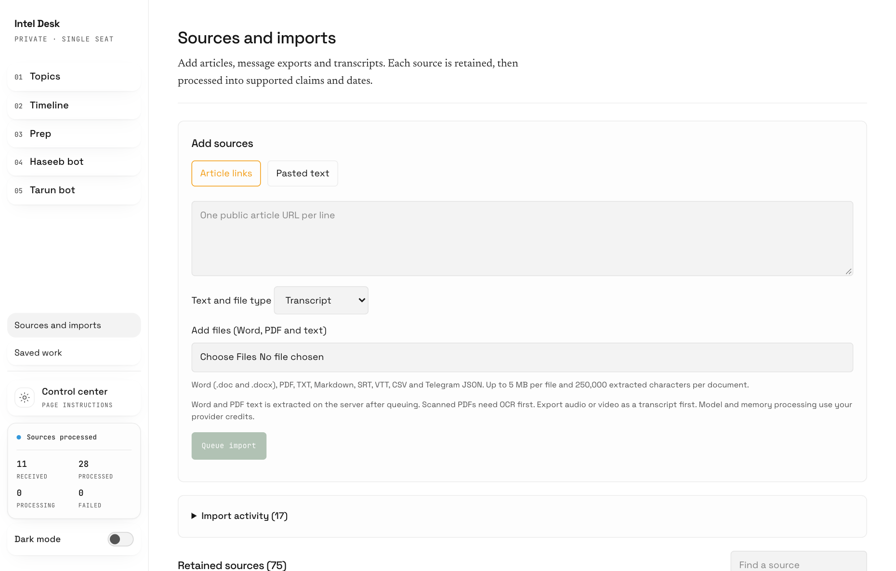
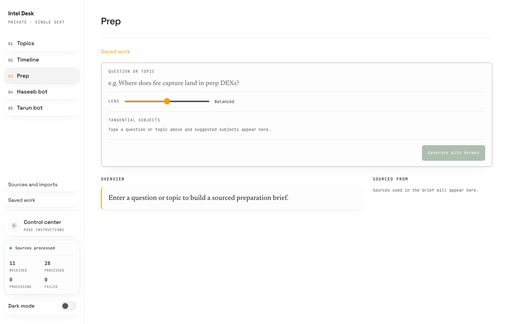
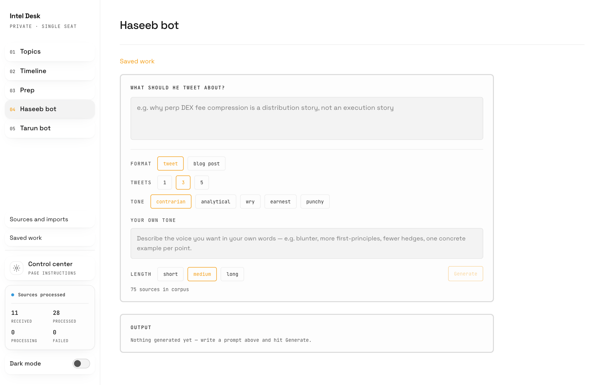

# Crypto Intelligence User Guide

Version 1.1 | 22 September 2026

Prepared for Mark Gerhart by Darshan Ahirrao
darshan@growthforgeai.com

## Start here

I built this guide to help you use Crypto Intelligence without needing to understand the code. Start with your own research, check what was retained, then use it to prepare for interviews or create writing drafts. You can return to any chapter when you need a particular task.

### Open the workspace

Go to https://crypto.forkedbrain.fyi/ and sign in with the dashboard credentials shared privately with you. Complete the verification challenge if it appears. Bookmark the site. If your session expires, sign in again; your saved research stays on the server.

Satoshi is the assistant you already use in Telegram. The dashboard gives you a visual workspace for the same Crypto Intelligence workflow. Use the established Satoshi conversation, not a similarly named bot found through search.

Your goal | Start here
--- | ---
Add research or upload 30 items | Sources and imports
Find evidence on a subject | Topics
Understand dated developments | Timeline
Prepare for an interview or panel | Prep
Write and revise a draft | Haseeb bot or Tarun bot
Reopen an earlier result | Saved work
Change recurring writing preferences | Control center
Change the website itself | Ask Satoshi to use the dashboard editor

The labels in this guide match the current sidebar. Dark mode changes how the site looks in your browser. It does not change the research or the generated results.

Keep access details private. There is no need to paste passwords or API keys into a research upload or a Telegram request.

## The brain and the research workspace

There are two web addresses because they serve different jobs. Crypto Intelligence is the research workspace. The brain is the native Hermes assistant interface behind Satoshi. Telegram is another way to speak to that assistant.

Surface | Use it for
--- | ---
Crypto Intelligence; https://crypto.forkedbrain.fyi/ | Upload sources, browse evidence and dates, prepare answers, write drafts and reopen saved work.
Hermes brain; https://brain.forkedbrain.fyi/ | Work with the assistant through its native web interface. Use the access instructions shared privately for this address.
Satoshi in Telegram; https://t.me/ForkedBrainSatoshi_Bot | Ask questions, forward individual sources, request memory recall and ask for controlled dashboard edits. Access remains limited to approved senders.

### One assistant does not mean one shared chat window

The assistant can use shared long-term memory across these workflows, but each conversation or generation task has its own immediate context. A new browser conversation should not be assumed to contain every message from Telegram. State your goal and ask it to retrieve the relevant saved material.

> Find the sources we saved about [topic]. Read the relevant passages, then continue from this goal: [what I need]. If something is missing, tell me rather than guessing.

### Which settings should I use

Use the dashboard Control center for recurring instructions about dashboard outputs. Use a specific Telegram request for a task. Changes to model providers, credentials, memory services or server configuration belong with the responsible maintainer.

The dashboard and brain can have different sign-in gates. Successfully signing into one does not guarantee a session in the other. If access fails, report which address failed and the error, without sending passwords.

The Technical Handover Guide explains the underlying services and how they connect. You do not need to administer those services to upload research or create drafts.

## Understand what Satoshi remembers

Memory has different forms. A message visible in chat, a retained source and a saved writing draft are separate records. Knowing which one you need makes recovery and follow-up questions much easier.

What you mean | Where it belongs
--- | ---
What we just discussed | The current Hermes conversation. Long conversations may be compacted into a shorter working summary.
A lasting preference or useful fact | Long-term memory in OpenViking, retrieved when relevant.
An article or transcript to cite | A retained research resource, with source details and a dashboard record.
A completed Prep result or draft | Saved work in the dashboard, with the saved inputs and revisions.
How the assistant should perform a task | A skill or a recurring dashboard instruction, depending on the task.

### Ask for a specific save and check it

> Remember that I prefer concise interview answers with a supporting source for each major claim. Tell me what was submitted to memory, then check that you can retrieve it.

Memory extraction can take place in the background. A submission acknowledgement does not always mean a new, separate memory record has already been created. The service may combine it with an existing memory. For an important fact, ask for a later retrieval check.

### Correcting or removing something

Describe the exact fact or source to correct. Ask Satoshi to find the relevant record and confirm the intended change. Deleting a chat, undoing a website edit or removing a local preference does not automatically delete every related long-term memory or research record.

### When something appears forgotten

Give the title, topic, date or original wording. Ask Satoshi to search retained memory and read the original source. An unsuccessful first search can be a retrieval issue rather than missing storage. If it still cannot find the record, check Sources and imports or involve the maintainer before re-uploading everything.

## Upload research and walk away

Use Sources and imports for a group of articles, transcripts or message exports. Once the server confirms that all sources were queued, processing continues even if you close the browser.

1. Choose Article links and paste one public article URL per line. For a document copied to your clipboard, choose Pasted text instead.
2. For transcripts and documents, choose the appropriate Text and file type and select files under Add files (Word, PDF and text).
3. Review the selection. Remove an unwanted file before clicking Queue import.
4. Wait for the final confirmation that all sources were queued. You can then leave and check Import activity later.

For 30 pieces, use separate files for separate meetings or podcasts. You can select them together. Keep the page open while it is still submitting; accepted items and items still waiting in your browser are different.

## Choose the right file format

Word and PDF documents can now be uploaded directly. The system extracts their text after accepting the upload. It uses that text as research; it does not preserve the original page design as an editable Word or PDF document.

Material | Accepted format | What to expect
--- | --- | ---
Word transcript | .doc or .docx | Text extracted on the server.
Text based PDF | .pdf | Selectable text extracted. Scans need OCR first.
Plain text or notes | .txt or .md | One document becomes one source.
Subtitle transcript | .srt or .vtt | Upload the transcript, not the video.
CSV file | .csv | Read as a text document, not one source per row.
Telegram export | .json | Text messages become separate sources.
Public article | URL, one per line | The server attempts to retrieve the article.

### Limits to check before uploading

- Each file must be no larger than 5 MB. Each document must contain no more than 250,000 extracted characters. Split a long transcript into clearly named parts if needed.
- The server accepts up to 100 sources in one request. The website can divide a larger selection into smaller requests. A Telegram export can expand into many sources.
- Audio and video files need a transcript first. ZIP archives are not a supported upload format in the current interface.
- Password protected, damaged or image-only documents may fail extraction. Export a readable text copy or run OCR, which converts a scanned page into selectable text.

### Make sources easy to find

Use descriptive filenames such as “Stablecoin interview 2026-09-18.docx”. Include the speaker, date and article link in the document when available. This helps you recognise the source later without relying on the filename alone.

A private or paywalled URL may not be retrievable. If you have permission to use the content, upload or paste the text instead.

## Send research through Telegram

Use Satoshi for an individual forwarded message, a quick question or a research conversation. Use the website when you want an organised bulk upload and a visible list of processing jobs.

### Forward one item

1. Open your existing Satoshi conversation in Telegram.
2. Forward the message or share the article and explicitly say that it belongs in Crypto Intelligence.
3. Wait for the response. If another task is already running, let it finish before sending a different instruction.
4. Open Sources and imports on the website and search for the title or first words. Confirm that the retained source appears, then check evidence processing.

> Save this to Crypto Intelligence. Keep the original source link and date where available. Tell me when it is retained and whether dashboard processing is still pending.

### Bring in a Telegram history

Export the relevant chat as JSON using Telegram Desktop where export is available, then upload result.json through Sources and imports. Choose JSON rather than an HTML export. Text-bearing messages are separated into sources; sender, date and message identifiers are carried through when present.

An export containing only photos, audio or other media will not provide usable message text for those items. Supply a transcript or accompanying text. Review the export before uploading so that you only include the research you intend to retain.

### What a batch means today

The website provides durable bulk processing. A Telegram conversation saying “start batch” or “process batch” should not be treated as an installed batch-capture feature. Dedicated Telegram collection mode, ZIP manifests and a single automatic batch-completion notification are not part of the verified current interface.

If an item seems missing, check its title and processing status first. Repeated forwarding is not a reliable way to diagnose a delay.

## Understand the processing stages

A queued upload is safely accepted for background work. It is not yet proof that the source has been extracted into claims or added to the Timeline. Check the individual source when you need certainty.

Stage | Meaning | Where to check
--- | --- | ---
Queued | The server accepted an import job. | Import activity
Import processing | Retrieval or document text extraction is underway. | Import activity
Source saved | The source has been retained. Evidence work may still be pending. | Retained sources
Evidence processed | Claims and any supported dates have been extracted. | Source details, Topics and Timeline
Failed | One stage could not finish. The other stage may already have succeeded. | The failed import or source record

### Use the right retry

If the import failed before a usable source was retained, use Retry import in Import activity. If the source is saved but evidence extraction failed, use Retry processing on that source. Fix the underlying issue, such as credits or an unreadable file, before retrying.

### Let the accepted work continue

After a full queue confirmation, you can close the site. If submission stops partway through, some items may already be accepted. Review the accepted count and remaining selection, then submit only what remains. Do not assume the whole batch failed.

Processing speed varies with document length, queue size and model availability. There is no fixed completion time for 30 items. Status views refresh while open and when you return to them. A browser refresh does not force a failed import to succeed.

### Why the numbers differ

One source may yield many claims, several dates, or no usable dates at all. Imports, retained sources, processed sources and timeline events are different counts. Older records may also have been created through another ingestion path. Use the individual record instead of treating the sidebar totals as a one-to-one reconciliation.

Duplicate detection uses source identifiers and content identity where available. It is not a guarantee that every reworded or differently formatted copy will be recognised.

## Find and check evidence in Topics

Topics groups the retained claims so you can explore a subject across sources. A claim is something a source says. Its presence in the dashboard does not make it independently verified.

1. Open Topics and use Find a topic. Choose a tag if you want to narrow the list.
2. Open a topic to see Evidence by category.
3. Use Filter by source, Window or Source type to narrow the evidence. Choose clear filters if the page becomes empty.
4. Expand Supporting passage for the text behind a claim. Select Read retained source to inspect the stored source.
5. Use the original-source link, when available, to compare the claim with its original context.

### Read across sources

Compare statements rather than assuming every source agrees. A collection can contain conflicting forecasts, outdated figures and uncertain interpretations. The source label identifies where a statement came from; the supporting passage is the best starting point for checking it.

> Using our retained research on stablecoin payments, compare the strongest arguments and disagreements. Cite the sources and separate facts from forecasts. Tell me where evidence is missing.

### When new material is not visible

First confirm that the source has completed evidence processing. Then clear filters. If the collection needs reorganising, use Rebuild Topics in Control center. That is a saved background job and may take several minutes for a large collection.

The time-window filter uses the dates associated with claims. Undated evidence may not appear in a recent-date filter. All time is the safest starting point when checking whether a source contributed any evidence.

### A useful habit

Before taking a figure into an interview or public post, open the source and check its date, units and meaning. Ask Satoshi for the original passage if a summary is too broad.

## Read the Timeline correctly

Timeline organises supported dated developments. It is not a list of upload dates, and an imported transcript does not automatically deserve a dated event.

1. Open Timeline and choose the relevant year or category.
2. Select an entry to open its detail view.
3. Read the event description, related source claims and Sources before relying on the summary.
4. Check what is known, what is interpretation and whether any forward-looking claim is actually stored.

Date or label | What it tells you
--- | ---
Event date | When the source supports a development happening.
Publication date | When the article or source was published.
Capture date | When material was saved to the system.
Undated evidence | Useful material without a supported event date.
Mentions | Linked evidence references, not a guarantee of independent corroboration.

### Why a source can have no dated entries

A transcript may discuss a trend without naming a date. The system should retain the claims without inventing a date or using the upload day as the event day. Check Sources and imports or Topics for this material.

### New entries and refresh

The Timeline reads saved records and refreshes as the page updates. Newly completed extraction can add supported entries. Reloading the page retrieves the latest records; it does not reanalyse every source or manufacture missing events.

### Report an unclear entry

Send the entry title, source title and what is wrong, such as an incorrect date, repeated provenance text or an unclear summary. Ask for an evidence-backed correction. Changing a website layout and correcting research data are different tasks, so name the record you mean.

No forward-looking claim is a valid result when the source contains none. Treat forecasts as attributed opinions, not confirmed future events.

## Prepare for an interview or panel

Prep turns a question and stored evidence into a structured brief. Start with the specific discussion you expect to have, then adjust how widely it should connect to other subjects.

1. Enter your question in Question or topic. For example: “How are stablecoins changing cross-border payments?”
2. Set Lens from a narrow focus to a wider view. Add tangential subjects if you want particular connections included.
3. Select Generate with Hermes and wait for the result.
4. Read the overview and supporting points. Open a point to inspect its evidence and any stated weaknesses.

Completed results are saved automatically. Reopen them through Saved work. Keep the page open until generation finishes; the walk-away guarantee for accepted imports does not mean every interactive generation is a background batch.

If your browser closes during generation, check Saved work before starting another request. For follow-up practice, ask Satoshi to interview you using the retained sources and challenge unsupported answers.

## Create and revise writing

Haseeb bot and Tarun bot are writing workflows informed by creator reference material. They produce drafts for you to review. They do not publish to social accounts or act as the named people.

1. Open either writing page and describe the subject, intended audience and main point.
2. Choose tweet or blog post. For tweets, choose 1, 3 or 5. Select a tone and length, or describe Your own tone.
3. Select Generate. Review the result and its source grounding.
4. Enter specific feedback and choose Revise. Use Copy when you are happy with the text.

> Make this easier for a general crypto audience. Keep the source-backed numbers, explain the technical term, remove generic phrases and make the opening more direct.

Revisions are saved with the draft. If Copy cannot access your clipboard, select and copy the text manually. Read the final text before publishing; a writing style can change while the underlying evidence still needs checking.

## Return to your saved work

Saved work is the place to reopen completed preparation and writing results. You do not need to recreate a successful result just because you closed a tab.

1. Open Saved work from the sidebar.
2. Find the relevant result using the available list and filters.
3. Open it in its original workflow, such as Prep or the correct creator page.
4. Use the revision selector where available to compare earlier and newer versions.

### Give useful revision feedback

Describe the change and what should stay. “Make it better” leaves too much open. “Reduce this to three points, keep the stablecoin example and make the conclusion less confident” gives the assistant a concrete target.

> Keep the structure and source citations. Rewrite only the opening for a nontechnical audience. Do not add new factual claims.

### Three different kinds of history

History | What it stores | Where you use it
--- | --- | ---
Saved work revisions | Generated briefs and writing drafts. | Saved work and workflow revision selector
Instruction history | Changes to recurring page instructions. | Control center
Website commits | Published dashboard code changes. | Ask Satoshi for dashboard history

Selecting an earlier writing revision does not roll back the website. Restoring a page instruction does not delete sources. A code revert does not erase research uploaded since the older release.

### If an older result looks different

Older saved results may have a simpler text-only presentation if structured details were not stored at the time. Open the saved result before regenerating it. New generation can consume credits and may produce a different answer.

For material you want to use outside the dashboard, copy the reviewed text into your own working document. This is separate from the system backup process described in the Technical Handover Guide.

## Adjust recurring preferences

Control center changes the instructions used by supported generation workflows. Use it for recurring preferences such as tone, structure or topic organisation. A website code edit is not needed for every wording preference.

1. Open Control center and choose Topics, Prep, Haseeb bot or Tarun bot.
2. Read the current instruction. Add the behaviour you want in clear language.
3. Select Save instructions. The input must be between 80 and 4,000 characters.
4. Generate a new result to see the effect. For Topics, select Rebuild Topics after saving when you want the new organisation applied.

> Write for an informed reader who is new to this particular subject. Define unfamiliar terms once, use short paragraphs and concrete examples, keep citations attached to factual claims, and state uncertainty plainly.

### Defaults and history

Restore default returns that page to its code-owned default instruction and records the change. Saving instructions does not rewrite existing saved drafts or modify original research. Citation checks, validation and the evidence rules remain in place.

### Topic rebuilding

Rebuild Topics reviews the stored collection in batches. Progress is saved and you can leave after the job is queued. Existing topics remain available until a valid replacement is ready. Check the job status before starting another rebuild.

### Daily intelligence

Expand Daily intelligence and background generation to review scheduled briefs. Pause scheduled briefs stops future scheduled starts; it does not cancel a request already running. Enable scheduled briefs resumes the schedule. Generate brief now requests a fresh brief.

Scheduled briefs, manual generation and topic rebuilding can use provider credits. The brief reflects the configured research workflow and available evidence; it is not a guarantee of complete real-time market coverage. Timeline is evidence-driven and does not have a free-form page instruction.

## Ask Satoshi clearly

Tell Satoshi whether you want to save research, get an answer, create writing or change the dashboard. That distinction helps it choose the right skill and avoids turning a research document into a software change request.

### Save a source

> Save this to Crypto Intelligence. Preserve the original link, author and date where available. Confirm the retained source title and processing status.

### Keep writing references separate

> This is Creator Reference material. Use it to understand writing style, and keep factual claims grounded in their own sources.

### Ask an evidence based question

> Using the research we have retained, explain the main disagreements about fixed-rate lending. Cite sources and tell me where the evidence is thin.

### Prepare and improve a draft

> Help me prepare a five-minute answer for an interview. Start with the main point, give two supported examples and finish with the strongest counterargument.

> Humanize this draft while preserving meaning, source references and uncertainty. Remove generic phrases and keep my tone direct.

### Ask about progress

> Check the status of the item titled [source title]. Tell me whether it is retained, still processing or failed. Do not submit it again.

### What Satoshi can and cannot change

Satoshi can use the installed Crypto Intelligence skills and the dedicated dashboard editor. That editor has a specific release process. It is not unrestricted control of every application on the VPS. Larger integrations, destructive data changes and new services need separate implementation and review.

Satoshi can maintain skill instructions through its existing learning workflow, but a message saying a skill was improved is not proof that website code was changed, tested or published. Ask for the relevant source, result or deployed commit.

## Ask Satoshi to edit the dashboard

The dashboard editor lets you request a specific website change through Satoshi. Every published edit goes through checks and a GitHub commit, giving you a version you can refer to or restore later.

1. Describe one focused change and where it belongs. Include a screenshot or the exact page label when useful.
2. State what must remain unchanged, especially research ingestion, saved data or source citations.
3. Say whether you want the change published after checks or only prepared for review.
4. Wait for a deployed result and the commit link. Then refresh the website and verify the requested behaviour.

> Use the dashboard editor to make the Sources and imports help text clearer for beginners. Keep every supported format, size limit and import behaviour unchanged. Publish after the required checks pass, then give me the commit link and explain what changed.

### What happens behind the scenes

A dedicated native Hermes editing session uses GPT-6 Astra with High reasoning in a separate working copy. The host then runs the required regression tests, type checks and builds. Before a release, it backs up the dashboard database and deployment configuration, records the code in GitHub and checks the deployed service.

Reported status | What you should assume
--- | ---
Queued or editing | Work is in progress. The live site has not necessarily changed.
Checked | Checks passed, but publication is not confirmed.
Deployed | The release completed. Review the live result.
Blocked or failed | The request did not complete successfully. Read the reason.

The editor does not silently switch to another model if Astra High is unavailable. GitHub or release-check failures can also block publication. The existing dashboard can continue running while a proposed edit is blocked. Start the next edit after the current one finishes.

## Undo a website change

Ask Satoshi to restore the previous published dashboard version if an edit does not work as intended. A restore creates a new commit in the history, so the original change remains traceable.

### Undo the most recent release

> Use the dashboard editor to undo the last published dashboard change. Preserve retained research and saved work. Tell me when the restore is deployed and give me the new commit link.

### Restore a specific version

1. Ask: “Show recent dashboard changes and their commit links.”
2. Identify the published version you want. Use the full commit identifier from the history.
3. Ask Satoshi to restore the dashboard to that commit and preserve research data.
4. Wait for deployed confirmation, reload the affected page and check the behaviour.

### Code and research are different

A website restore changes the application code. It does not intentionally delete new sources or roll the database back to an old copy. If a code change also requires a database change, a maintainer must review compatibility before a routine restore is allowed.

Accidentally imported content is a data issue. Do not ask for a website rollback to remove it. Give the maintainer the exact source and request a targeted correction or removal, including any retained-memory copies that also need attention.

### If the assistant cannot finish the restore

Keep the failed run identifier and current commit link. Ask the maintainer to inspect the release history and failed check. Repeatedly asking for different restores can make the situation harder to understand.

### What has been verified

A real native Hermes edit was published and then restored on 21 September 2026. The restored dashboard source matched the pre-test version, and the recorded research counts were unchanged. This demonstrates the implemented release-and-undo path; it does not guarantee that every future code or data change is automatically reversible.

## Credits and temporary provider errors

Research processing and generation depend on the configured model provider. If credits are exhausted, adding credits is necessary before the provider can accept more work. A generic authentication message alone does not prove that the password or key is wrong.

### If the provider reports an error

1. Note the exact time, action and message. Avoid repeatedly resending the same research.
2. Have the billing owner check the provider account used by Satoshi, including its available credits and limits.
3. After a top-up, allow time for the next recovery attempt and send one short new message to Satoshi.
4. If the message succeeds, check failed imports or evidence jobs and retry the specific failed stage where needed.

### The installed recovery check

An external timer checks for a known stale quota state every two minutes. A healthy check does not make a model request. Only a recognised quota condition triggers a small provider probe after the waiting period. The stale state is cleared only after the same configured credential succeeds.

The process respects retry timing and uses longer waits after repeated failures. It does not clear genuine exhausted-credit or authentication failures, restart the whole gateway, replay interrupted work, or rewrite old Telegram messages. Two minutes is the check interval, not a guaranteed recovery time. If the same stale error returns after recovery, involve the maintainer; a running session may retain old state.

### Control unnecessary usage

- Review existing Saved work before generating the same result again.
- Use one focused prompt and specific revision feedback.
- Pause scheduled briefs in Control center when they are not needed.
- Check progress before re-uploading a large batch. Thirty long transcripts can cost more than thirty short messages.

Ask the billing owner for actual usage and spend from the provider dashboard. The website does not provide a complete billing ledger, and processing time is not a reliable measure of money spent. Current provider prices and account limits can change.

## Solve common problems

Start with the record or page that failed. The quickest useful support report includes the page name, source title or edit run, approximate time, expected result and actual error. Omit passwords, tokens and private keys.

What you see | First action
--- | ---
Cannot sign in | Use the privately supplied credentials and complete verification. If access still fails, ask the maintainer to check the login service.
Import accepted but no timeline entry | Check evidence status and whether the source supports an event date. Look in Topics too.
Word or PDF extraction failed | Check 5 MB and text limits, password protection and selectable text. Try a text export or OCR.
New topic is missing | Check processing, clear filters, then consider Rebuild Topics.
Source saved but processing failed | Resolve the provider or document issue, then use Retry processing.
Generation interrupted | Check Saved work before generating again.
Provider authentication failed | Check the actual provider error and credits. Do not assume a bad password from the generic label.
Website edit seems absent | Ask for its run status and deployed commit, then refresh the site.
Copy button does not work | Select and copy the output text manually.

### Words you will see

Source: the retained material. Claim: a statement extracted from a source. Evidence: the supporting passage. Queue: accepted work waiting its turn. Revision: a saved version of an output. Commit: a recorded code version. VPS: the server running the services. OCR: converting page images to readable text.

### Where to go next

Use Quick Start for a two-page reminder. Give the Technical Handover Guide to the person managing the server, code, backups or GitHub handover. GitHub ownership transfer is still a separate handover step; the running website does not depend on you manually editing files in GitHub.
